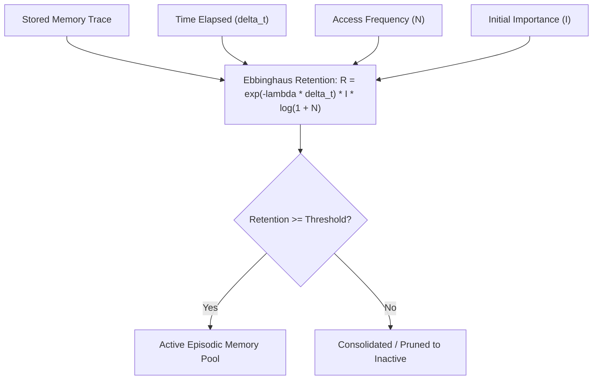

# genpark-episodic-memory-temporal-decay-manager-skill

Agent Skill implementing **Ebbinghaus Forgetting Curves & Temporal Memory Consolidation** in 100% Python standard library.

## Architectural Flow

